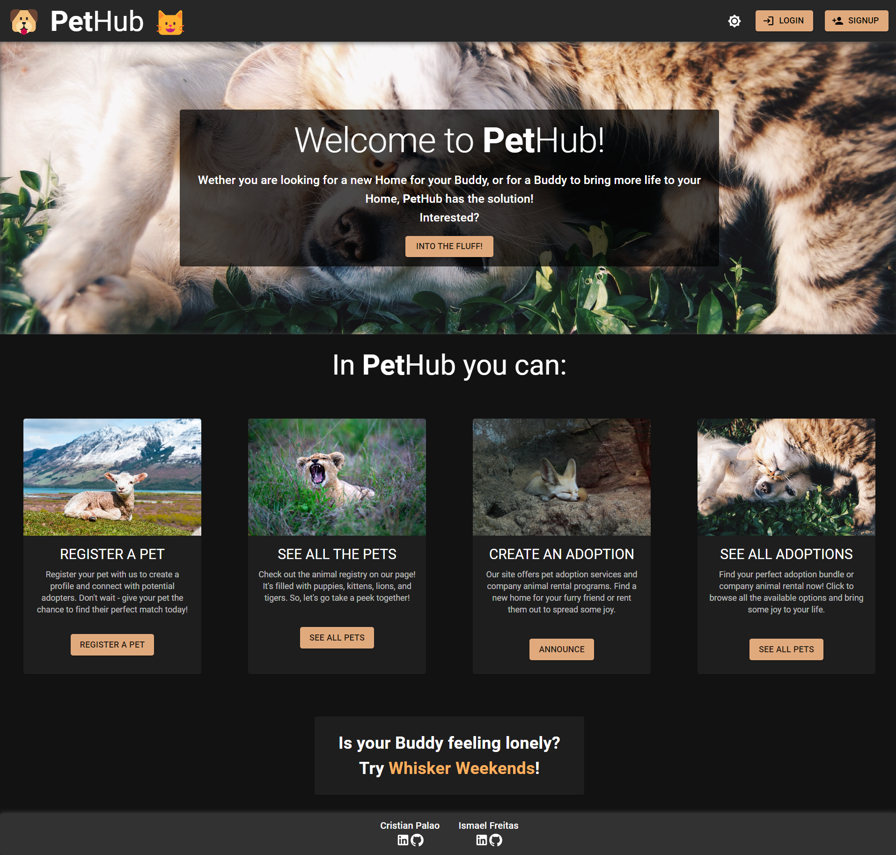

# PetHub ReactApp

## Alert

- This repository only contains the FRONTEND code of the whole PetHub project!!!
- To check the BACKEND repository, CLICK [HERE](https://github.com/PetHub-MERN/pethub-server)!

## Description

- PetHub is a web app that allows it's users to register pets just to display them, or to put them for adoption, in adoption bundles
- It also allows the users to chat with the PetHub community in a common chat
- It uses:
    - React for interface building
    - Material UI component library
    - Axios to send requests to our REST API
    - Socket.io to manage socket events in the client side

## How to use

- Create an Account, using a Username, Email (not verified) and Password
- Log in and Check all Pets and Adoptions already registered by other users
- Check your User Profile page, to see your Pets, Adoption and Edit your Profile Picture
- Register your own Pets by choosing a Name, Date of Birth, Species, Breed, Description and Picture for them
- Put your registered Pets for Adoption, creating a new Adoption bundle in the Adoptions page
- Edit or Delete your Pets and Adoptions, in their details page
- Chat with other online users in the Chat page

## Presentation

- Find out more about this project!
[Click to See Presentation!](https://drive.google.com/file/d/1sbukhnu7VPgh2sEfA0Od8Z15yslWLQot/view?usp=sharing)

## Web Page

- Feel like having a look at cute Pets???
[Click to See!](https://pethubpet.netlify.app/)

## Things that we didn't manage to do before the Code Freeze

- Direct messaging between the users and adoption Announcers
- Notification system for the direct messages system

## If you want to play around with this Repository

- Fork this Repo, and clone your fork to your machine
- Fork our REST API's repo, and clone it to your machine
- Open both repos, and run "npm install" in both
- Run "npm start" in this repo
- Run "npm run dev" in your REST API's repo

## From React

### Available Scripts

In the project directory, you can run:

#### `npm start`

Runs the app in the development mode.\
Open [http://localhost:3000](http://localhost:3000) to view it in your browser.

The page will reload when you make changes.\
You may also see any lint errors in the console.

#### `npm test`

Launches the test runner in the interactive watch mode.\
See the section about [running tests](https://facebook.github.io/create-react-app/docs/running-tests) for more information.

#### `npm run build`

Builds the app for production to the `build` folder.\
It correctly bundles React in production mode and optimizes the build for the best performance.

The build is minified and the filenames include the hashes.\
Your app is ready to be deployed!

See the section about [deployment](https://facebook.github.io/create-react-app/docs/deployment) for more information.

#### `npm run eject`

**Note: this is a one-way operation. Once you `eject`, you can't go back!**

If you aren't satisfied with the build tool and configuration choices, you can `eject` at any time. This command will remove the single build dependency from your project.

Instead, it will copy all the configuration files and the transitive dependencies (webpack, Babel, ESLint, etc) right into your project so you have full control over them. All of the commands except `eject` will still work, but they will point to the copied scripts so you can tweak them. At this point you're on your own.

You don't have to ever use `eject`. The curated feature set is suitable for small and middle deployments, and you shouldn't feel obligated to use this feature. However we understand that this tool wouldn't be useful if you couldn't customize it when you are ready for it.

Hi, I'm Ismael!

I am from Coimbra. I'm always looking for a challenge, and that eventually led me to programing, where the errors and bugs keep presenting themselves to you.

My current goal is to find a job in the great Tech Industry. In my free time I enjoy reading, exercising, binge watch series and go for a hike in the weekends.